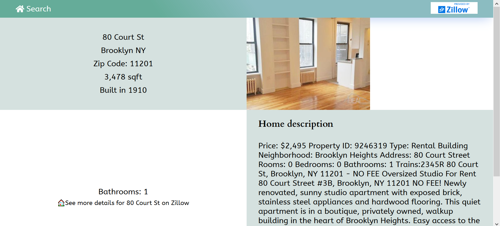

# A brief user's guide

This react app uses React to search and display home data, after downloading/cloning the code, please run `npm install` to install necessary packages and `npm run start` to run the app and open http://localhost:3000 to see the app.

## How to use the app

1.  Please type in the search terms as the first example picture shows below, and click on the key-shape button to search properties. Both the address and a combination of city and abbreviated state (separated by a space) are needed for the search. the search terms are case-insensitive.
2.  After a map and markers representing property locations show on the page, please click on the markers to check the basic information about the properties(as the second example picture shows). You can use mouse wheel to zoom in or zoom out the map.
3.  If there is a "details" word at the end of the information in the popup and you are interested in the property, please click on the "details" to see the details page of the selected property.The third example picture below displays the details page.
4.  On the details page, you can go back to search page by clicking on the "Search" link near the top-left corner of the page or by clicking on back button of the browser.

### Example Pictures

### My thanks to

Data and brand logo provide by Zillow API;
Map provided by Mapbox;
default property Photo by Tierra Mallorca on Unsplash;
search page background house Photo by Jesse Roberts on Unsplash;

## Thank you for using the app!

---

This project was bootstrapped with [Create React App](https://github.com/facebook/create-react-app).

## Available Scripts

In the project directory, you can run:

### `npm start`

Runs the app in the development mode. 
Open [http://localhost:3000](http://localhost:3000) to view it in the browser.

The page will reload if you make edits. 
You will also see any lint errors in the console.

### `npm test`

Launches the test runner in the interactive watch mode. 
See the section about [running tests](https://facebook.github.io/create-react-app/docs/running-tests) for more information.

### `npm run build`

Builds the app for production to the `build` folder. 
It correctly bundles React in production mode and optimizes the build for the best performance.

The build is minified and the filenames include the hashes. 
Your app is ready to be deployed!

See the section about [deployment](https://facebook.github.io/create-react-app/docs/deployment) for more information.

### `npm run eject`

**Note: this is a one-way operation. Once you `eject`, you can’t go back!**

If you aren’t satisfied with the build tool and configuration choices, you can `eject` at any time. This command will remove the single build dependency from your project.

Instead, it will copy all the configuration files and the transitive dependencies (Webpack, Babel, ESLint, etc) right into your project so you have full control over them. All of the commands except `eject` will still work, but they will point to the copied scripts so you can tweak them. At this point you’re on your own.

You don’t have to ever use `eject`. The curated feature set is suitable for small and middle deployments, and you shouldn’t feel obligated to use this feature. However we understand that this tool wouldn’t be useful if you couldn’t customize it when you are ready for it.

## Learn More

You can learn more in the [Create React App documentation](https://facebook.github.io/create-react-app/docs/getting-started).

To learn React, check out the [React documentation](https://reactjs.org/).

### Code Splitting

This section has moved here: https://facebook.github.io/create-react-app/docs/code-splitting

### Analyzing the Bundle Size

This section has moved here: https://facebook.github.io/create-react-app/docs/analyzing-the-bundle-size

### Making a Progressive Web App

This section has moved here: https://facebook.github.io/create-react-app/docs/making-a-progressive-web-app

### Advanced Configuration

This section has moved here: https://facebook.github.io/create-react-app/docs/advanced-configuration

### Deployment

This section has moved here: https://facebook.github.io/create-react-app/docs/deployment

### `npm run build` fails to minify

This section has moved here: https://facebook.github.io/create-react-app/docs/troubleshooting#npm-run-build-fails-to-minify
